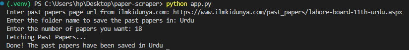

# paper-scraper
A Python tool to scrape and download Board Past Papers from ilmkidunya.com

<h3>How To Use</h3>

<ol>
  <li>
    Copy the URL of the page with the past papers for your desired subject and class. Such as this page which has past papers of Computer Science from Lahore       Board ICS Part-1: https://www.ilmkidunya.com/past_papers/lahore-board-11th-urdu.aspx
  </li>
  <li>
    When you run the python.py, you will be asked to enter the URL copied in step 1. Paste your URL there.
  </li>
   <li>
    Then you will be asked to enter the name of the folder you want to save the past papers in. The folder will be created inside the paper-scraper folder from     where you can move it to your desired location.
  </li>
   <li>
    Finally you will be asked by the paper-scraper program to enter the number of papers you want.
  </li>
</ol>

Example of the paper-scraper process from VSCode terminal:

<h3>Result</h3>

Then it will start downloading the papers which will take some time depending on your internet speed. The expected result would look like this:

